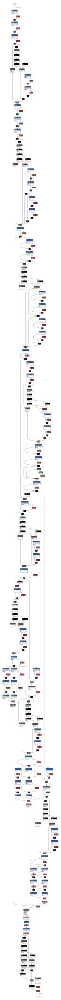

# Guns Detection with YOLOv8
A model that is able to detect guns in images and videos.

- [x] Build the model (YOLOv8 Ultralytics | Python)
- [ ] Integrate the model to the bakcend (Flask API)
- [ ] Build the front end application (Angular)
- [ ] Freeze requirements


## Setup

Clone the project
```
git clone https://github.com/BecayeSoft/Guns-Detection-YOLOv8
```

Install the requirements
```
pip install requirements.txt
```

## Understanding the Code
### main.py
`main.py` loads the dataset from Roboflow using a `DataFlow.py` object,
train a YOLOv8 model using `Model.py` on the dataset, and exports the model. <br>
Finally, it logs the model to [Comet](https://www.comet.com/) using `Monitor.py`.


### ImageDownLoader.py
A class that contains methods to download images from Google, unsplash and pixabay.

### download_image.py
A script that download images using `ImageDownLoader.py`.

### DataFlow.py
A class to load the dataset from [Roboflow](https://roboflow.com/).<br>
Additionally, it contains two methods to load a [Roboflow](https://roboflow.com/) model
trained on a specific version of the dataset, and another method to make inference.<br>
These two were never used.

### Model.py
A class that contains everything to build the model.<br>
`Model.py` contains methods to load or train the model, make inferences, export the model and more. 

### Monitor.py
A class to monitor the model's performances using [Comet](https://www.comet.com/).<br>
`Monitor.py` contains methods to log the hyperparameters, the performance metrics and to upload the model.

By default, the model is automatically logged to [Comet](https://www.comet.com/). 
This class allows us to create custom logs.

## Model Graph

